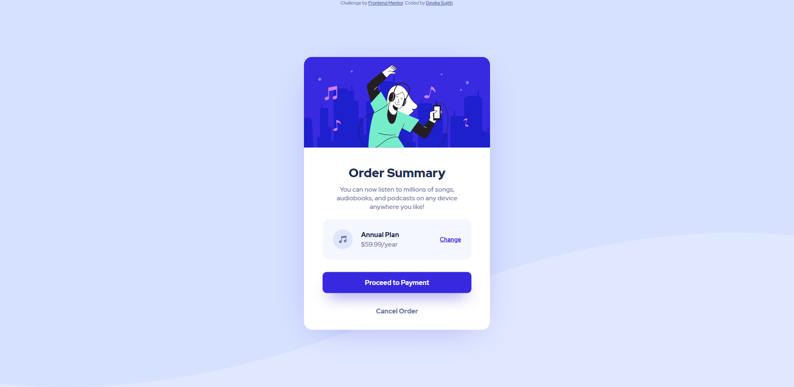

# Frontend Mentor - Order summary card solution

This is a solution to the [Order summary card challenge on Frontend Mentor](https://www.frontendmentor.io/challenges/order-summary-component-QlPmajDUj). Frontend Mentor challenges help you improve your coding skills by building realistic projects. 

## Table of contents

- [Overview](#overview)
  - [Screenshot](#screenshot)
  - [Links](#links)
- [My process](#my-process)
  - [Built with](#built-with)
  - [What I learned](#what-i-learned)
  - [Continued development](#continued-development)
  - [Useful resources](#useful-resources)
- [Author](#author)

**Note: Delete this note and update the table of contents based on what sections you keep.**

## Overview

### The challenge

Users should be able to:

- See hover states for interactive elements

### Screenshot



### Links

- Solution URL: [https://github.com/DCoder18/Order-Summary-Component](https://github.com/DCoder18/Order-Summary-Component)
- Live Site URL: [https://order-summary-deecoder.netlify.app/](https://order-summary-deecoder.netlify.app/)

## My process

### Built with

- SCSS
- Flexbox
- BEM Model

### What I learned

This project helped me practice advanced CSS concepts like flexbox and the BEM model for efficient code.

Something helpful I learnt in flexbox is a way to align a **single item** horizonatally. As we know `justify-content` helps us do this 
but what if I want to use it to align just a single element? In this project I struggled a bit with aligning the `Change now` CTA in 
the **Annual plan** section with flexbox. At first I tried `justify-content: space-between` but I realized the music icon and the header 
don't have equal space between them but I still needed the CTA on the other end! That got me thinking if there was a way for `justify-content`
to work like `align-self`. After rummaging through some Stack Overflow threads, I came across the perfect solution.

```css
 .btn-change {
    margin-left: auto;
    justify-content: flex-end;
 }
```

The above worked like a charm. If an element had to be aligned to the left, just use `margin-right: auto;`.

### Continued development

I'm still not 100% comfortable with efficient responsive code.

### Useful resources

- [How to justify a single flexbox item](https://stackoverflow.com/questions/23621650/how-to-justify-a-single-flexbox-item-override-justify-content/34063808#34063808)

## Author

- Frontend Mentor - [@DCoder18](https://www.frontendmentor.io/profile/DCoder18)